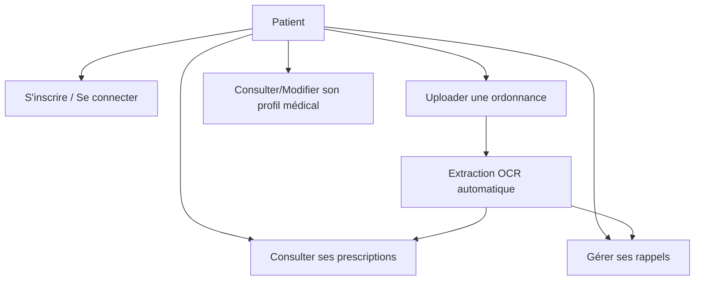
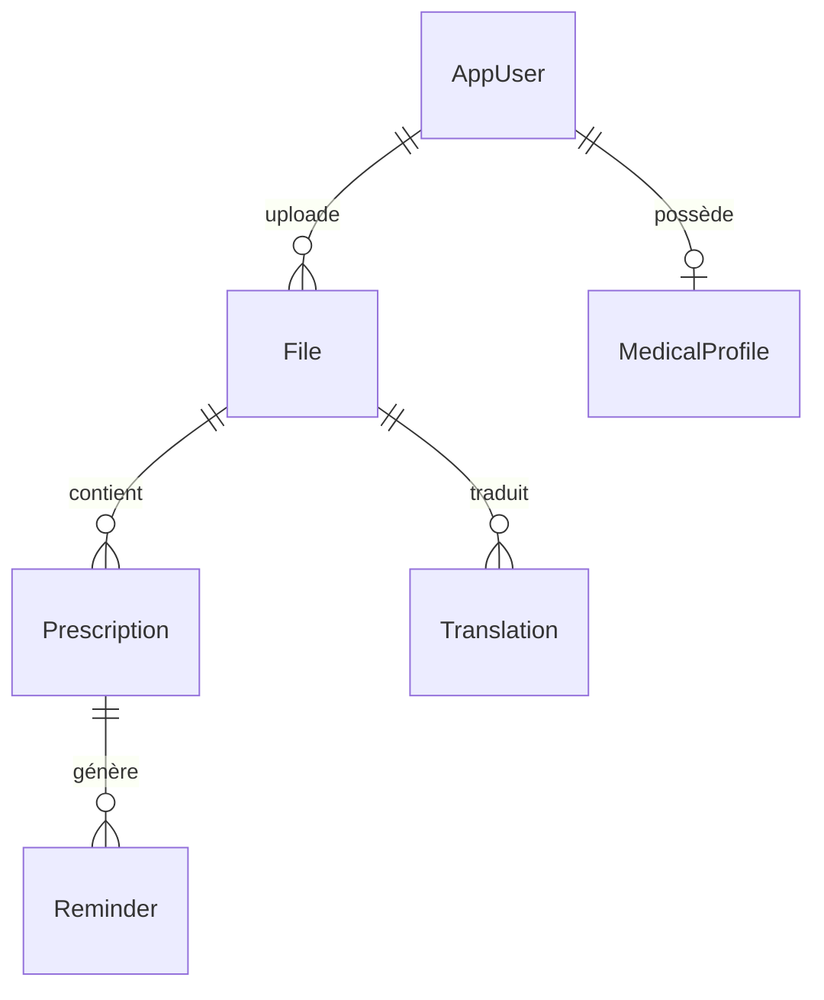
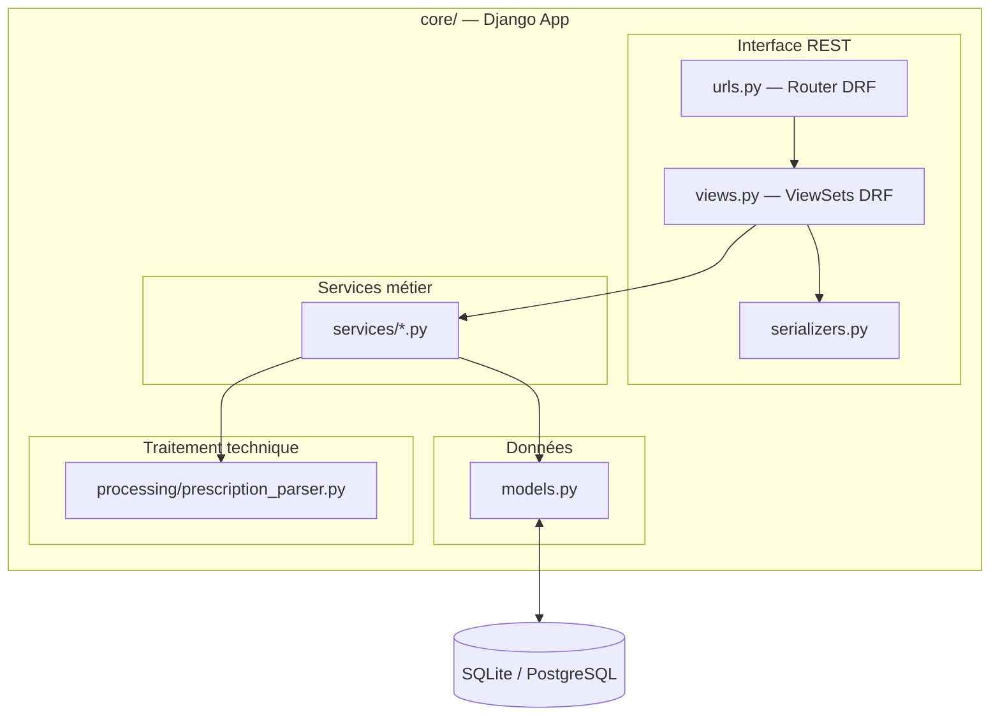
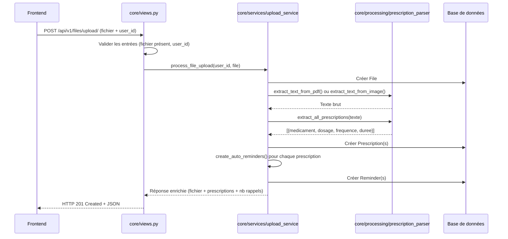
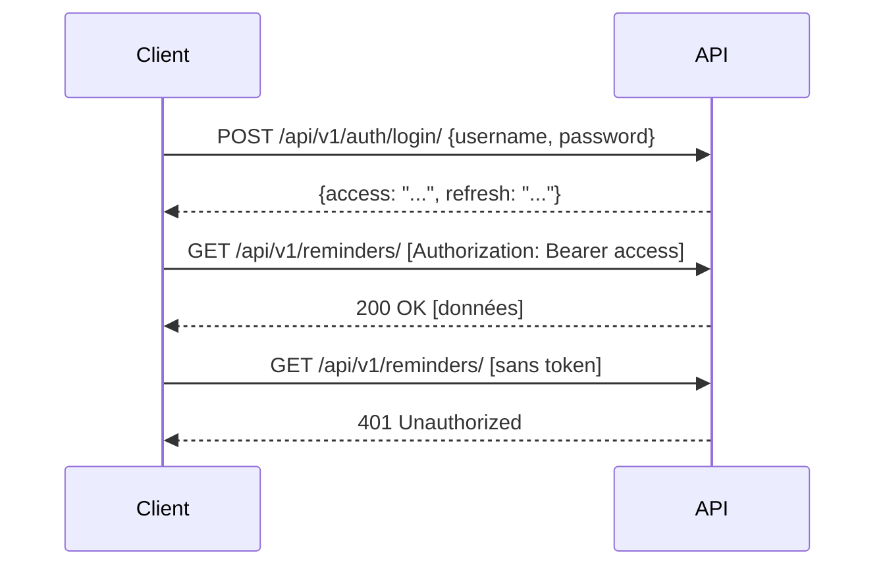
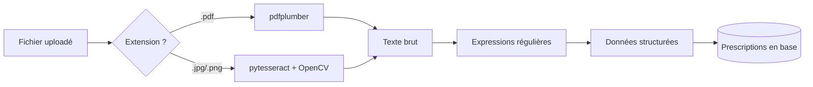
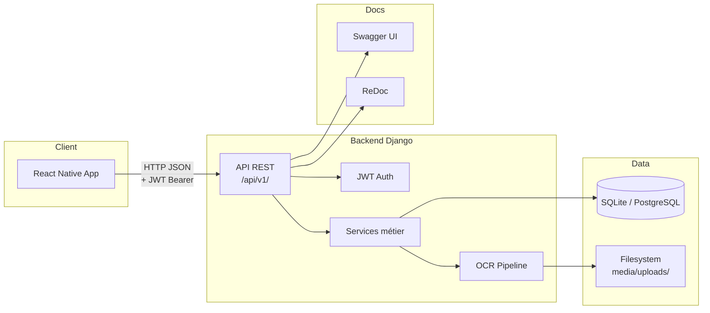

# OrdoCare — Document d'Architecture

Ce document décrit l'architecture du backend OrdoCare (Django/DRF), en structurant la présentation
selon les trois niveaux d'architecture enseignés en cours : **fonctionnelle**, **applicative** et **technique**.

---

## 1. Architecture Fonctionnelle

> *Décrit les fonctions métier du système, indépendamment de la technologie.*

### 1.1 Objectif du système

OrdoCare est une application de gestion d'ordonnances médicales. Elle permet à un patient de :
- **Scanner** une ordonnance (photo ou PDF)
- **Extraire automatiquement** les prescriptions (médicaments, dosages, fréquences)
- **Recevoir des rappels** de prise de médicaments
- **Consulter** son historique médical et ses ordonnances

### 1.2 Acteurs

| Acteur       | Description                                       |
|--------------|---------------------------------------------------|
| **Patient**  | Utilisateur principal. Uploade, consulte, reçoit des rappels. |
| **Système OCR** | Composant technique qui extrait le texte des ordonnances. |

### 1.3 Cas d'utilisation principaux



### 1.4 Entités métier

| Entité            | Description                                               |
|-------------------|-----------------------------------------------------------|
| `AppUser`         | Utilisateur de l'application (patient)                    |
| `File`            | Fichier uploadé (ordonnance PDF/image)                    |
| `Prescription`    | Médicament extrait d'une ordonnance (nom, dosage, fréquence, durée) |
| `Reminder`        | Rappel de prise de médicament (heure, statut, notification) |
| `MedicalProfile`  | Profil de santé (allergies, antécédents, contacts urgence) |
| `Translation`     | Traduction de texte médical (évolution future)            |

### 1.5 Relations entre entités



---

## 2. Architecture Applicative

> *Décrit la structuration logique de l'application, les couches, les flux de données
> et les principes de conception appliqués.*

### 2.1 Style architectural : Django App avec Service Layer

OrdoCare suit une **architecture Django standard avec Service Layer**, structurée
autour d'une app Django unique (`core/`) qui regroupe modèles, vues, serializers,
services et processing.



### 2.2 Couches et responsabilités

| Couche          | Dossier              | Responsabilité                                             |
|-----------------|----------------------|------------------------------------------------------------|
| **Interface**   | `core/views.py`      | Exposer l'API REST, sérialiser les données, documenter via Swagger |
| **Sérialisation** | `core/serializers.py` | Conversion JSON ↔ modèles Django, schémas Swagger       |
| **Services**    | `core/services/`     | Logique métier (auth, upload, reminders)                  |
| **Modèles**     | `core/models.py`     | Entités métier (ORM Django)                                |
| **Traitement**  | `core/processing/`   | Traitements techniques : OCR, parsing regex                |
| **Infrastructure** | `core/admin.py`, `core/authentication.py` | Admin Django, authentification JWT |
| **Configuration** | `ordocare_dj/`     | Settings Django, URLs racine, WSGI                         |

### 2.3 Structure des dossiers

```
backend_django/
├── manage.py
├── ordocare_dj/                  # Configuration Django
│   ├── settings.py               # SQLite local / PostgreSQL déploiement
│   ├── urls.py                   # Routes racine + Swagger + versioning
│   └── wsgi.py
├── core/                         # App Django principale
│   ├── models.py                 # Entités métier (AppUser, File, Prescription, etc.)
│   ├── views.py                  # ViewSets DRF + endpoints auth
│   ├── serializers.py            # Sérialisation + schémas Swagger
│   ├── urls.py                   # Routage REST (Router DRF)
│   ├── admin.py                  # Interface admin Django
│   ├── authentication.py         # JWT custom (AppUser)
│   ├── services/                 # Logique métier
│   │   ├── auth_service.py       # Inscription / Connexion
│   │   ├── upload_service.py     # Upload + OCR + extraction
│   │   └── reminder_service.py   # Parsing fréquence/durée + rappels auto
│   ├── processing/               # Traitement technique
│   │   └── prescription_parser.py # OCR (pdfplumber/Tesseract) + regex
│   ├── management/commands/      # Commandes Django
│   ├── migrations/               # Migrations base de données
│   └── tests/                    # Tests pytest (53 tests)
│       ├── conftest.py           # Fixtures partagées
│       ├── test_api.py
│       ├── test_auth_service.py
│       ├── test_reminder_service.py
│       └── test_prescription_parser.py
└── docs/                         # Documentation
    └── architecture.md           # Ce document
```

### 2.4 Principes de conception appliqués

Les 7 principes de conception du cours sont appliqués comme suit :

| # | Principe                    | Application dans OrdoCare                                |
|---|-----------------------------|---------------------------------------------------------|
| 1 | **Séparation des préoccupations** | Vues = HTTP uniquement. Logique métier dans `core/services/`. OCR dans `core/processing/`. |
| 2 | **Modularité**              | Structure en sous-dossiers : `services/`, `processing/`, `tests/` au sein de `core/`. |
| 3 | **Abstraction**             | Les vues ne connaissent pas les détails OCR. Elles appellent `process_file_upload()` sans savoir si c'est du regex ou du ML. |
| 4 | **Faible couplage**         | `core/processing/` ne dépend d'aucune autre couche du projet. `core/services/` ne dépend pas des vues. |
| 5 | **Forte cohésion**          | Chaque service a une responsabilité unique : `auth_service` = auth, `upload_service` = upload+OCR, `reminder_service` = rappels. |
| 6 | **Évolutivité**             | Le module `core/processing/` peut être remplacé par du ML sans toucher aux vues ni aux services. |
| 7 | **Réutilisabilité**         | Les services sont appelables depuis les vues, les tests, ou un futur CLI. Les serializers servent au CRUD et à la documentation Swagger. |

### 2.5 Règles de dépendances (unidirectionnelles)

```
core/views.py  →  core/services/*  →  core/models.py
                                   →  core/processing/*
```

- `core/views.py` → dépend de `core.services`, `core.models`, `core.serializers`
- `core/services/` → dépend de `core.models` et `core.processing`
- `core/models.py` → ne dépend que de Django et du standard Python
- `core/processing/` → ne dépend d'aucune autre couche (libre de dépendre de libs OCR/vision)

**Règle** : ne jamais introduire de logique métier dans `core/views.py`.
Les vues orchestrent et délèguent au service approprié.

### 2.6 Flux principal : Upload d'ordonnance



---

## 3. Architecture Technique

> *Décrit les choix technologiques, les protocoles, l'infrastructure et le déploiement.*

### 3.1 Stack technique

| Composant          | Technologie                                  |
|--------------------|----------------------------------------------|
| **Backend**        | Python 3.10, Django 5.1, DRF 3.15            |
| **Frontend**       | React Native (Expo)                          |
| **Base de données** | SQLite (local) / PostgreSQL (déploiement)   |
| **Authentification** | JWT via SimpleJWT                           |
| **OCR**            | pdfplumber (PDF) + pytesseract (images)      |
| **Vision**         | OpenCV (prétraitement images)                |
| **Documentation API** | Swagger/OpenAPI via drf-yasg               |

### 3.2 API REST — Conventions appliquées

L'API suit les conventions REST enseignées en cours :

#### Ressources et URIs

Les URIs désignent des **ressources** (noms au pluriel), jamais des verbes :
```
POST   /api/v1/reminders/          → créer un rappel
DELETE  /api/v1/reminders/{id}/     → supprimer un rappel
```

Anti-patterns corrigés :
```
AVANT :  POST   /reminders-create/          → verbe dans l'URI
APRÈS :  POST   /api/v1/reminders/          → ressource + verbe HTTP

AVANT :  DELETE  /reminders-delete/{id}/     → verbe dans l'URI
APRÈS :  DELETE  /api/v1/reminders/{id}/     → ressource + verbe HTTP
```

#### Verbes HTTP

| Méthode  | Sémantique       | Exemple                              |
|----------|------------------|--------------------------------------|
| `GET`    | Lire             | `GET /api/v1/users/`                 |
| `POST`   | Créer            | `POST /api/v1/auth/register/`        |
| `PUT`    | Remplacer        | `PUT /api/v1/users/1/medical-profile/` |
| `PATCH`  | Modifier partiel | `PATCH /api/v1/reminders/5/`         |
| `DELETE` | Supprimer        | `DELETE /api/v1/reminders/5/`        |

#### Codes HTTP utilisés

| Code | Signification            | Utilisé pour                            |
|------|--------------------------|-----------------------------------------|
| 200  | OK                       | Lecture, mise à jour, connexion          |
| 201  | Created                  | Inscription, upload, création ressource  |
| 204  | No Content               | Suppression réussie                      |
| 400  | Bad Request              | Champs manquants ou invalides            |
| 401  | Unauthorized             | Identifiants invalides, token manquant   |
| 404  | Not Found                | Ressource inexistante                    |
| 409  | Conflict                 | Username/email déjà utilisé              |

#### Versioning

Toutes les routes API sont préfixées par `/api/v1/`.
Cela permet de faire évoluer l'API (v2, v3…) sans casser les clients existants.

#### Sous-ressources REST

Les relations sont exprimées par des sous-ressources :
```
GET /api/v1/users/{id}/files/          → fichiers de l'utilisateur
GET /api/v1/users/{id}/prescriptions/  → prescriptions de l'utilisateur
GET /api/v1/users/{id}/reminders/      → rappels de l'utilisateur
GET /api/v1/users/{id}/medical-profile/ → profil médical
```

### 3.3 Carte complète des endpoints

```
AUTH
  POST   /api/v1/auth/register/                  → Inscription (201)
  POST   /api/v1/auth/login/                     → Connexion (200)

USERS
  GET    /api/v1/users/                          → Liste utilisateurs
  GET    /api/v1/users/{id}/                     → Détail utilisateur
  GET    /api/v1/users/{id}/files/               → Fichiers utilisateur
  GET    /api/v1/users/{id}/prescriptions/       → Prescriptions utilisateur
  GET    /api/v1/users/{id}/reminders/           → Rappels utilisateur [Auth]
  GET    /api/v1/users/{id}/medical-profile/     → Profil médical [Auth]
  PUT    /api/v1/users/{id}/medical-profile/     → MAJ profil [Auth]
  PATCH  /api/v1/users/{id}/medical-profile/     → MAJ partielle profil [Auth]

FILES
  GET    /api/v1/files/                          → Liste fichiers
  GET    /api/v1/files/{id}/                     → Détail fichier
  GET    /api/v1/files/{id}/download/            → Télécharger fichier
  POST   /api/v1/files/upload/                   → Upload ordonnance + OCR (201)

PRESCRIPTIONS
  GET    /api/v1/prescriptions/                  → Liste prescriptions
  GET    /api/v1/prescriptions/{id}/             → Détail prescription

REMINDERS [Auth requise]
  GET    /api/v1/reminders/                      → Liste rappels
  POST   /api/v1/reminders/                      → Créer rappel (201)
  GET    /api/v1/reminders/{id}/                 → Détail rappel
  PATCH  /api/v1/reminders/{id}/                 → Modifier rappel
  DELETE /api/v1/reminders/{id}/                 → Supprimer rappel (204)

TRANSLATIONS
  GET    /api/v1/translations/                   → Liste traductions
```

### 3.4 Documentation Swagger / OpenAPI

Chaque endpoint est documenté avec :
- **Description** de l'opération
- **Schéma de requête** (body, paramètres)
- **Schémas de réponse** par code HTTP (200, 201, 400, 404, 409…)
- **Tags** pour le regroupement (auth, users, files, reminders…)

Accès :
- Swagger UI : `http://localhost:8000/swagger/`
- ReDoc : `http://localhost:8000/redoc/`
- JSON/YAML : `http://localhost:8000/swagger.json`

### 3.5 Authentification JWT



- **Access token** : durée de vie 5h, utilisé pour chaque requête authentifiée
- **Refresh token** : durée de vie 1 jour, permet de renouveler l'access token
- Header : `Authorization: Bearer <access_token>`

### 3.6 Pipeline OCR



Extraction regex des champs :
- **Médicament** : nom du produit
- **Dosage** : quantité (ex: "500mg", "1 comprimé")
- **Fréquence** : nombre de prises par jour (ex: "3 fois par jour", "matin et soir")
- **Durée** : période de traitement (ex: "7 jours", "2 semaines")
- **Conditions** : conditions de prise (ex: "si douleur", "pendant les repas")

### 3.7 Configuration et environnement

| Variable        | Description                          | Défaut            |
|-----------------|--------------------------------------|-------------------|
| `DB_ENGINE`     | Moteur de base de données            | SQLite (si absent) |
| `DB_NAME`       | Nom de la base PostgreSQL            | ordocare          |
| `DB_USER`       | Utilisateur PostgreSQL               | postgres          |
| `DB_PASSWORD`   | Mot de passe PostgreSQL              | —                 |
| `SECRET_KEY`    | Clé secrète Django                   | dev-only-change-me |
| `DEBUG`         | Mode debug                           | True              |

**Stratégie** : SQLite en local (zéro config), PostgreSQL en déploiement via variables d'environnement.

### 3.8 Schéma d'architecture globale



---

## 4. Intégration ML (évolution prévue)

### Contrat d'interface
- **Entrée** : texte OCR brut d'une ordonnance
- **Sortie** : structure normalisée `{ medicament, dosage, frequence, duree, conditions }`

### Point d'insertion
Remplacer/compléter `core/processing/prescription_parser.py` par `core/processing/ml_parser.py` appelé par `core/services/upload_service.py`.

### Stratégie
- Feature-flag pour basculer entre regex et ML
- Tests comparatifs regex vs ML sur un corpus réel
- Le service `upload_service` appelle une interface abstraite (pattern Strategy), permettant le changement transparent

---

## 5. Conventions et règles

### Nommage
| Élément         | Convention       | Exemple                      |
|-----------------|------------------|------------------------------|
| Fichiers Python | `snake_case.py`  | `upload_service.py`          |
| Classes         | `PascalCase`     | `AppUserViewSet`             |
| Fonctions       | `snake_case`     | `process_file_upload`        |
| Constantes      | `UPPER_SNAKE`    | `ACCESS_TOKEN_LIFETIME`      |
| Serializers     | `*Serializer`    | `PrescriptionSerializer`     |
| ViewSets        | `*ViewSet`       | `ReminderViewSet`            |
| Services        | `*_service.py`   | `auth_service.py`            |

### Règles de code
- Pas de prints en production → logging Django
- Logique métier dans `core/services/`, jamais dans les vues
- Valider les entrées au niveau de l'interface (serializers DRF)
- Exceptions métier dans les services, traduction en HTTP dans les vues
- Petites fonctions testables, pas de fonctions « Dieu »

### Workflow Git
- Branches : `main` (stable), `develop` (intégration), `feature/<sujet>`
- PR petites et fréquentes
- `.gitignore` propre, `.env.example` commité, `.env` ignoré

---

## 6. Tests (stratégie)

| Niveau          | Cible                          | Outils            |
|-----------------|--------------------------------|--------------------|
| **Unitaire**    | Services (`auth_service`, `reminder_service`, `upload_service`), regex | `pytest`, `pytest-cov` |
| **Intégration** | Endpoints API (upload, auth)   | DRF test client + mocks OCR |
| **Qualité**     | Formatage, typage              | `black`, `isort`, `flake8`, `mypy` |
